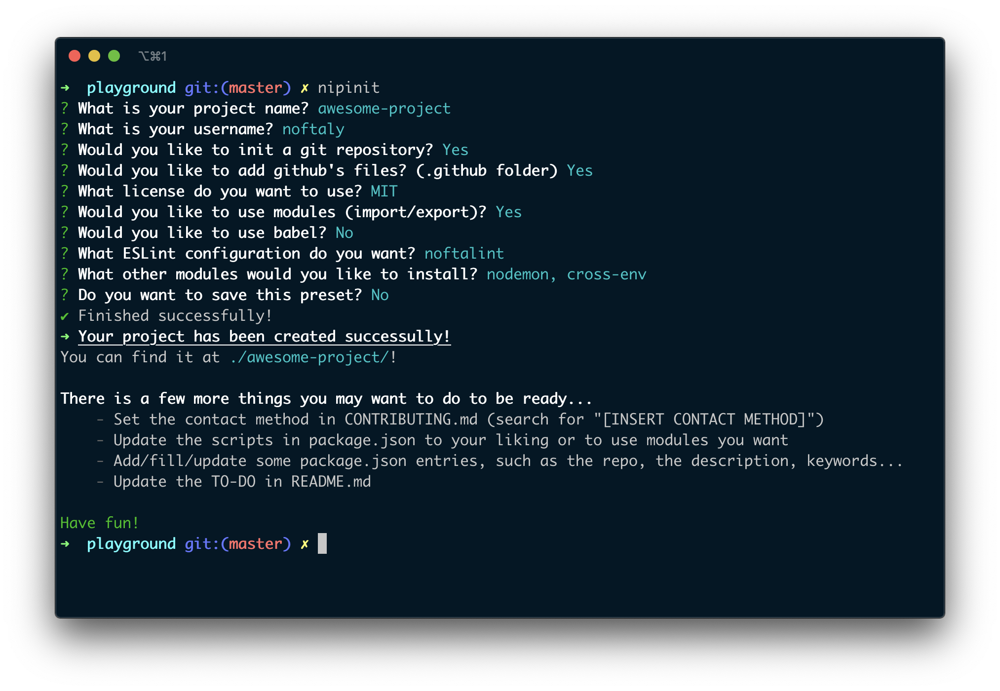

# nipinit


> 💻 A command-line utility to easily create new node projects.

:warning: As of 2.0.0, you __can__ use nipinit with Node.js v10.17.0 or higher. If you're still using v1.x.x, you have to use Node.js v14.8.0 or higher.


## Table of Content

- [Installation](#installation)
- [Features](#features)
- [Usage](#usage)
  - [Requirements](#requirements)
  - [Fresh start](#fresh-start)
  - [Presets](#presets)
  - [Other options](#other-options)
- [Screenshots](#screenshots)
- [TO-DO](#to-do)
- [License](#license)


## Installation

```shell
$ npm i -g nipinit
```


## Features

- Initialize an npm project
- Initialize Git & .gitignore
- Create GitHub's file (templates, changelog, contributing, and some actions (lint/build))
- Set a license (choose between MIT, ISC and GPL-v3)
- Use ES Modules (Node.js' ES Modules, not Babel's)
- Install & configure Babel
- Install & configure ESLint (choose between my configuration (noftalint), airbnb, recommended and standard)
- Install nodemon, cross-env and concurrently
- Create a README and a .editorconfig
- Save & use presets


## Usage

### Requirements

- You need to have Node.js v10.17.0 or newer to use nipinit. You can check your Node.js' version with `node -v`.

### Fresh start

To start a new node project with nipinit, go to the directory you want in your terminal, and type:
```shell
$ nipinit
```
You will be prompted some questions to generate the boilerplate that fits you the most, and you will be good to go!

### Presets

You can create presets when creating a new project (answer 'Yes' to the question `Do you want to save this preset?`).
After that, you can generate a new project using this preset just by adding the `--preset preset_name` (or `-p preset_name`) argument to nipinit.
```shell
$ nipinit --preset myCoolPreset
```

If you create a project without using a preset, but it happens that the exact same configuration is already saved, nipinit will tell you so you can use it next time!

You can also manage your presets with
```shell
$ nipinit presets
```

### Other options

There are multiple options (flags) you can add when running nipinit.
- `--preset`, `-p`: see the [section about presets](#presets)
- `--dump-error`, `-d`: Show the full error when one occurs.
- `--no-modules`: Create a new project without installing node modules
- `--no-color`: Create a new project without showing colors in the CLI


## Screenshots




## TO-DO

- [x] Make `--no-modules` add dependencies to the package.json (without installing them)
- [ ] Add unit tests
- [ ] Add an option to create the project with TypeScript
  - [ ] Use the `.ts` extension
  - [ ] Add the default dependencies (`typescript`, `@types/node`)
  - [ ] Add the other needed dependencies (for ESLint, such as `@typescript-eslint/parser` and `@typescript-eslint/eslint-plugin`)
  - [ ] Show only ESLint configurations that supports TypeScript
  - [ ] Create other TypeScript files (`tsconfig.json`, `types.ts`...)
  - [ ] And more...


## License

Copyright © 2020 Elliot 'noftaly' Maisl. Licensed under the MIT license, see [the license](./LICENSE).
