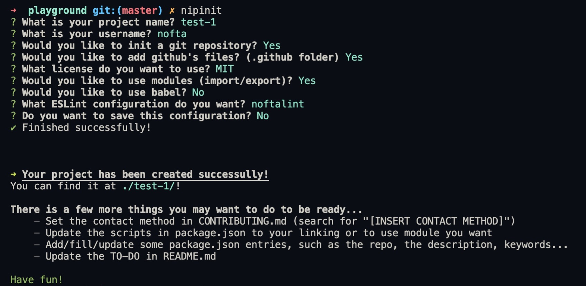

# Nipinit


> 💻 A command-line utility to easily create new NPM projects.

## Table of Contents
- [Installation](#installation)
- [Features](#features)
- [Usage](#usage)
  - [Fresh start](#fresh-start)
  - [Presets](#presets)
- [Screenshots](#screenshots)
- [TO-DO](#to-do)
- [License](#license)


## Installation

```shell
$ npm i -g nipinit
```


## Features

- Initialize NPM
- Initialize Git & .gitignore
- Create Github's file (templates, changelog, contributing, and if you set a linter, a lint action)
- Set a license (choose between, MIT, ISC and GPL-v3)
- Use ES Modules (real ES Modules, not babel)
- Install & configure Babel
- Install & configure ESLint (choose between my configuration (noftalint), airbnb,
and standard)
- Install & configure nodemon, cross-env and concurrently
- Create a README and a .editorconfig
- Save & use presets


## Usage

### Fresh start

To start a new NPM project, go to the directory you want in your terminal, and type:
```shell
$ nipinit
```
You will be prompts some questions to generate the boilerplate that fits you the most, and
you will be good to go!

### Presets

You can create presets when creating a new project. (answer 'Yes' to the prompt
`Do you want to save this preset?`).
After that, you can generate a new project using this preset just by adding the `--preset preset_name` argument to nipinit. (it has an alias: `-p`)
```shell
$ nipinit --preset myCoolPreset
```

If you create a project without using a prest, but it happens that the exact same preset is already
saved, nipinit will tell you so you can use it next time!

You can also manage your presets with
```shell
$ nipinit preset
```
Add the `--help` option to see all available arguments.


## Screenshots




## TO-DO

- [ ] Fix bug with overwriting of package.json causing to not having dependencies field
- [ ] Better split the project into multiple files/directory
- [ ] Don't use babel-node in production, build the project instead.
- [ ] Add a class to manage/query Database
- [ ] Improve error handling
- [ ] Lower the required node version (currently >=14.8.0, if we can lower it down to 14.0.0 or
even 12.x.x it would be nice). If we use babel, we will have to wait for a "transform top level
await plugin, the current one only parses it. Otherwise we can use rollup and
its "experimentalTopLevelAwait" option.
- [ ] Add unit tests
- [ ] Change the db type (move from JSON? Just change the lib?)


## License

Copyright © 2020 Elliot 'noftaly' Maisl. Licensed under the MIT license, see [the license](./LICENSE).
